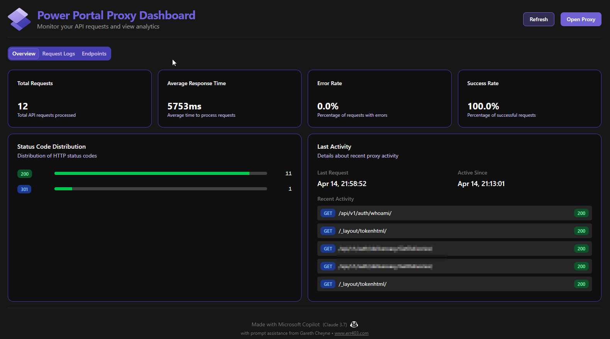

# React Power Portal Proxy

A lightweight proxy service for Microsoft Power Portal development that handles authentication using Playwright, with an integrated dashboard for monitoring and managing requests.

## Project Structure

This project consists of two main components:

1. **Proxy Service** - A Node.js proxy server that handles authentication and forwards requests
2. **Dashboard** - A Next.js web interface for monitoring and inspecting API requests

## Features

- Automatically handles authentication using Playwright
- Acts as a proxy for API requests
- Maintains session cookies and forwards them to the target application
- Interactive dashboard for monitoring API traffic
- Request inspector to analyze request/response details

## System Requirements

Before getting started, please ensure your system meets the following requirements:

- **Node.js**: v16 or newer (v18+ recommended)
- **npm**: v7 or newer
- **Python**: v3.8+ (required for Playwright's browser automation)
- **OS Support**: Windows 10/11, macOS 10.15+, or Ubuntu 20.04+ (other Linux distributions may work but are not officially supported)
- **Browsers**: At least one of the following browsers should be installed:
  - Microsoft Edge (preferred for Windows)
  - Google Chrome
  - Firefox (as fallback)
- **Dependencies**: Visual Studio Build Tools (Windows) or equivalent build tools for other platforms

## Prerequisites Installation

1. **Node.js & npm**: Download from [nodejs.org](https://nodejs.org/)
2. **Python**: Download from [python.org](https://www.python.org/downloads/)
3. **Browser Drivers**:
   - After installing the project dependencies, you can install the browser drivers with:
   ```
   npx playwright install
   ```
   - Or specifically for Chrome/Edge:
   ```
   npx playwright install chromium
   ```

## Setup

1. Make sure you have Node.js and Python installed as described above
2. Install dependencies:
   ```
   # Install all dependencies with a single command from the root directory
   npm install
   ```
3. Configure your `.env` file in the root directory (a template is provided below)
4. Build the dashboard for production:
   ```
   npm run build
   ```

## Environment Variables

Create a `.env` file in the root directory with the following settings:

```
# Environment variables for the application
POWERPORTAL_BASEURL=https://your-power-portal-url.com
AUTH_PROVIDER=https://auth-provider-url.com/authorize
LOGIN_URL=/Account/Login/ExternalLogin
RETURN_URL=/api/v1/auth/verify
```

Note: Username and password are no longer required in the .env file. Users will enter their credentials directly in the browser when prompted during authentication.

## Usage

Start both the proxy service and dashboard in production mode:

```
npm start
```

For development:

```
npm run dev
```

This will start:
- The proxy server on http://localhost:5000
- The dashboard on http://localhost:5001
- A browser window will automatically open for both the authentication process and the dashboard

You can also run each component separately:

```
# Run only the proxy server in dev mode
npm run dev-proxy

# Run only the dashboard in dev mode
npm run dev-dashboard

# Run only the proxy server in production mode
npm run start-proxy

# Run only the dashboard in production mode
npm run start-dashboard
```

## How it Works

1. When you start the server, it will use Playwright to open a browser window (Microsoft Edge or Chromium)
2. It will navigate to the login page where you need to enter your credentials
3. After successful authentication, it captures the cookies and headers
4. A success message appears letting you know that you can close the browser if desired
5. Subsequent requests are proxied to the target application with the authenticated session
6. The dashboard displays real-time information about API requests and responses

## Screenshots



The screenshot above shows the application's dashboard interface, which displays API request monitoring and provides tools for inspecting the requests and responses.

## Troubleshooting

Common issues and their solutions:

1. **Browser fails to launch**: 
   - Ensure Python 3.8+ is installed and in your PATH
   - Run `npx playwright install` to install browser dependencies
   - On Windows, you might need Visual Studio Build Tools: `npm install --global --production windows-build-tools`

2. **Authentication fails**:
   - Check your `.env` configuration
   - Ensure you have network connectivity to the Power Portal URL
   - Try with the `--open-browser` flag to see the authentication process

3. **Proxy doesn't work after authentication**:
   - Check that your session cookies were properly captured
   - Use the dashboard to review any error responses
   - Try refreshing the session using the dashboard controls

## Security Note

Your credentials are entered directly in the browser and are not stored in configuration files. The session data is stored temporarily for the duration of the proxy service and can be configured not to persist between restarts by using the appropriate command-line flags.

## Commands Reference

| Command | Description |
|---------|-------------|
| `npm install` | Install all dependencies for both proxy and dashboard |
| `npm run build` | Build the dashboard for production |
| `npm start` | Start both proxy and dashboard in production mode |
| `npm run dev` | Start both proxy and dashboard in development mode |
| `npm run close` | Shutdown the application completely (can also use the dashboard UI button) |